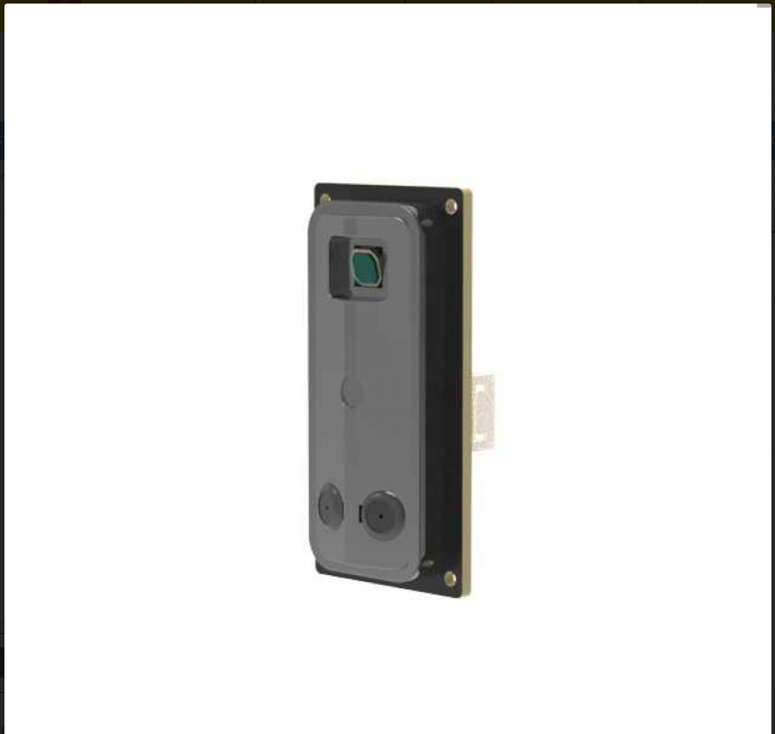

# YDLidar GS5 Arduino Library

This repository contains an Arduino library for the YDLidar GS5 solid-state LIDAR sensor.



## Features

-   Easy-to-use, non-blocking interface.
-   Initializes the sensor and parses calibration data automatically.
-   Provides a simple function to read LIDAR data points (angle, distance, intensity).
-   Compatible with ESP32 and other Arduino-compatible boards with a free `HardwareSerial` port.

## Hardware

-   [ESP32 NodeMCU Board](https://www.probots.co.in/esp32-wifi-ble-bluetooth-4-0-iot-development-nodemcu-board-38-pin.html) or any other Arduino-compatible board.
-   [YDLidar GS5](https://probots.co.in/ydlidar-gs5-solid-state-distance-sensor-rangefinder-1000mm-uart.html): The LIDAR sensor.

### Connections

The connections are simple and use a hardware serial port. The example uses `Serial2` on the ESP32.

| Board      | YDLidar GS5 |
| :--------- | :---------- |
| TX Pin     | RX          |
| RX Pin     | TX          |
| 3.3V       | 3.3V        |
| GND        | GND         |

## Usage

1.  Install the library by cloning this repository into your Arduino `libraries` folder.
2.  Open the `BasicScan` example from `File > Examples > YDLidarGS5 > BasicScan`.
3.  Upload the sketch to your board.
4.  Open the Serial Monitor at `115200` baud to see the output.

### Example Code

Here is a simple example of how to use the library:

```cpp
#include <YDLidarGS5.h>

// Define the serial port for the LIDAR
HardwareSerial& lidarSerial = Serial2;

// Create an instance of the YDLidarGS5 class
YDLidarGS5 lidar(lidarSerial);

// Define RX and TX pins for ESP32
#define RX_PIN 16
#define TX_PIN 17

void setup() {
  Serial.begin(115200);
  lidarSerial.begin(921600, SERIAL_8N1, RX_PIN, TX_PIN);

  Serial.println("Starting YDLidar GS5...");

  if (lidar.begin()) {
    Serial.println("LIDAR initialized successfully.");
    if (lidar.startScan()) {
      Serial.println("Scan started.");
    } else {
      Serial.println("Failed to start scan.");
    }
  } else {
    Serial.println("LIDAR initialization failed.");
  }
}

void loop() {
  YDLidarGS5::LidarPoint points[160];
  int count = lidar.readScan(points, 160);

  if (count > 0) {
    Serial.printf("Read %d points:\n", count);
    for (int i = 0; i < count; i++) {
      Serial.printf ("  Angle: %.2f, Distance: %d, Intensity: %d\n",
                    points[i].angle, points[i].distance, points[i].intensity);
    }
  }
}
```

## How to get better accuracy from the sensor

-   **Stable Power Supply**: Ensure a stable 3.3V power supply to the LIDAR. USB power from a computer might be noisy.
-   **Correct Baud Rate**: The baud rate is set to `921600` in the code. Ensure this matches the LIDAR's configuration.
-   **Shielding**: In some environments, external light or other sources of interference can affect the LIDAR's performance. Ensure the sensor is appropriately shielded.
